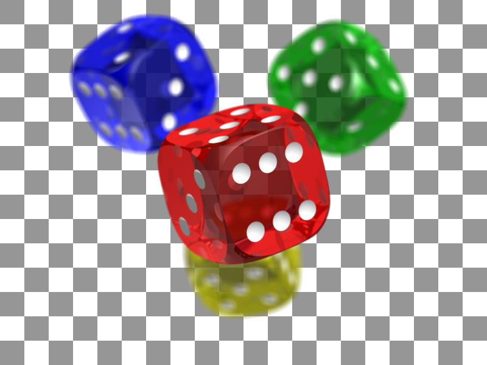

# Chapitre 1 : L'Hygiène du Personnel

Chaque membre de l'équipe est un maillon essentiel de la chaîne de sécurité. Votre hygiène personnelle est la première barrière contre la contamination des aliments.

<h3 class="text-lg font-bold mb-2">Objectifs de la formation</h3>
<ul class="list-disc pl-4 space-y-2">
<li>Comprendre l'importance de l'hygiène</li>
<li>Apprendre les bonnes pratiques</li>
<li>Prévenir les risques microbiologiques</li>
</ul>

## 1. Le Lavage des Mains

<h3 class="text-lg font-bold mb-2">Étapes du lavage correct</h3>
<ol class="list-decimal pl-4 space-y-2">
<li>Humidifier les mains</li>
<li>Appliquer du savon</li>
<li>Frotter toutes les surfaces</li>
<li>Rincer abondamment</li>
<li>Sècher avec une serviette propre</li>
</ol>

<table class="table-auto w-full text-sm">
<thead>
<tr>
<th class="px-4 py-2 bg-gray-100">Temps minimum</th>
<th class="px-4 py-2 bg-gray-100">Type de savon</th>
<th class="px-4 py-2 bg-gray-100">Température</th>
</tr>
</thead>
<tbody>
<tr>
<td class="px-4 py-2 border">20 secondes</td>
<td class="px-4 py-2 border">Antibactérien</td>
<td class="px-4 py-2 border">30-40°C</td>
</tr>
</tbody>
</table>

!!! tip "Quand se laver les mains ?"
    Le lavage des mains est **obligatoire** et systématique :
    - [x] En arrivant au poste de travail.
    - [x] Après être allé aux toilettes.
    - [x] Après avoir toussé, éternué ou s'être mouché.
    - [x] Après avoir manipulé des poubelles ou des produits d'entretien.
    - [x] Après avoir touché des aliments crus (viande, poisson, œufs).
    - [x] Avant de manipuler des aliments cuits ou prêts à être consommés.

## 2. La Tenue de Travail

<h3 class="text-lg font-bold mb-2">Éléments obligatoires</h3>
<ul class="list-disc pl-4 space-y-2">
<li>Vêtements de travail complets</li>
<li>Chaussures de sécurité</li>
<li>Coiffe adaptée</li>
<li>Protection des plaies</li>
</ul>

<table class="table-auto w-full text-sm">
<thead>
<tr>
<th class="px-4 py-2 bg-gray-100">Élément</th>
<th class="px-4 py-2 bg-gray-100">Règles</th>
</tr>
</thead>
<tbody>
<tr>
<td class="px-4 py-2 border">Vêtements</td>
<td class="px-4 py-2 border">Propres, complets, changés quotidiennement</td>
</tr>
<tr>
<td class="px-4 py-2 border">Chaussures</td>
<td class="px-4 py-2 border">Antidérapantes, fermées</td>
</tr>
<tr>
<td class="px-4 py-2 border">Coiffe</td>
<td class="px-4 py-2 border">Obligatoire pour couvrir toute la chevelure</td>
</tr>
</tbody>
</table>

<h3 class="font-bold">Interdictions absolues</h3>
<ul class="list-disc pl-5">
<li> Bijoux de toute sorte</li>
<li> Vernis à ongles et faux ongles</li>
<li> Manger, fumer ou vapoter dans les zones de préparation</li>
</ul>

## 3. État de Santé

<h3 class="font-bold">Signaler immédiatement</h3>

En cas de :

<ul class="list-disc pl-5 mt-2">
<li>Gastro-entérite</li>
<li>Vomissements</li>
<li>Fièvre</li>
<li>Coupures ou brûlures</li>
</ul>

Signalez impérativement à votre responsable avant de commencer le travail.

<h3 class="text-lg font-bold mb-2">Premiers soins</h3>
<ol class="list-decimal pl-4 space-y-2">
<li>Nettoyer la plaie</li>
<li>Désinfecter</li>
<li>Protéger avec un pansement étanche</li>
<li>Utiliser un gant ou doigtier pour les mains</li>
</ol>

