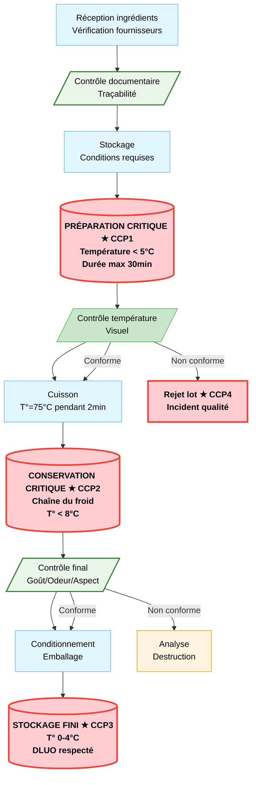

# Fiches de Fabrication HACCP - Méthode Optimale

Les fiches de fabrication sont la mise en application concrète de la méthode HACCP pour nos recettes. Elles transforment une recette de cuisine en une procédure de travail sûre et reproductible.

Chaque fiche détaille :
- Les ingrédients et leur origine
- Le déroulement des opérations sous forme de diagramme
- Les points de maîtrise et les CCP (Points Critiques) avec leurs limites

## Comment lire les diagrammes ?

Les diagrammes de fabrication permettent de visualiser rapidement le processus. Une attention particulière doit être portée aux étapes critiques, les étapes notées en rouge.

## Code Couleur et Symbolique

| Type d'étape | Apparence | Signification |
|--------------|-----------|---------------|
| **Étape normale** | Rectangle bleu clair | Opération standard de fabrication |
| **CCP (Point Critique)** | Rectangle rouge avec bordure épaisse | Contrôle obligatoire pour la sécurité ★ |
| **Contrôle qualité** | Rectangle vert | Vérification ponctuelle |
| **Porte qualité** | Rectangle vert foncé | Validation avant passage à l'étape suivante |
| **Attente/Retravail** | Rectangle orange | Pause ou correction dans le processus |

## Modèle de Diagramme de Fabrication

# Identification des Points Critiques

Les CCP sont identifiés selon les critères suivants :

## 1. Risques microbiologiques
- Températures dangereuses (zone 5-65°C)
- Temps d'exposition prolongé
- Manutention sans protection

## 2. Risques physiques
- Étapes de découpe/tranchage
- Utilisation d'équipements lourds
- Manipulation de produits chauds

## 3. Risques chimiques
- Utilisation d'additifs alimentaires
- Nettoyage/assainissement
- Conservation avec produits chimiques

## 4. Critères de validation
- Impact direct sur la sécurité consommateur
- Non-détection possible en étape ultérieure
- Mesure objective possible
- Limites clairement définies

# Informations obligatoires pour chaque CCP

Chaque CCP identifié doit comporter :
- ★ CCP + Numéro (identification claire)
- Limite critique (température, temps, pH, etc.)
- Méthode de surveillance
- Fréquence de contrôle
- Personne responsable
- Actions correctives prévues